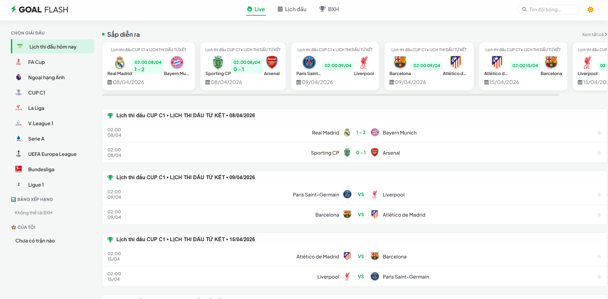

<div align="center">
  
  <h1>GoalFlash Premier League</h1>
  <p>
    
    
    
  </p>
</div>

## Giới thiệu dự án
GoalFlash Premier League là một ứng dụng web gọn nhẹ giúp theo dõi lịch thi đấu, kết quả và bảng xếp hạng bóng đá (tối ưu cho giải Ngoại Hạng Anh). Dữ liệu được cào (scrape) tự động và liên tục từ nguồn 24h.com.vn thông qua backend Node.js, giúp mang lại thông tin thời gian thực mà không cần API key từ bên thứ ba.

---

### Giao diện dự án 📸



---

## Tính năng chính
- **Dữ liệu thời gian thực:** Lịch thi đấu và bảng xếp hạng được cập nhật tự động. Giao diện trang web tự làm mới mỗi 30 giây để luôn hiển thị thông tin mới nhất.
- **Tối ưu hiệu năng:** Tích hợp bộ nhớ đệm (cache) 60 giây trên server để tối thiểu hóa số lượng request lên máy chủ nguồn.
- **Web App hiện đại:** Được cấu trúc như một ứng dụng web (với manifests & service worker).

## Tech Stack
- **Frontend:** HTML5, CSS3, JavaScript (Vanilla), PWA (Progressive Web App).
- **Backend:** Node.js, Puppeteer (Web Scraping). 

## Quick Start
Yêu cầu hệ thống: **Node.js 18+**

```bash
# Cài đặt các thư viện cần thiết
npm install

# Khởi chạy server
npm start
```
Mở trình duyệt và truy cập: `http://localhost:3000`

## Documentation
Cấu hình hệ thống thông qua các biến môi trường trong file `.env`:
- `PORT`: Cổng khởi chạy server (mặc định: 3000).
- `CACHE_TTL_MS`: Thời gian lưu cache dữ liệu, tính bằng mili-giây (mặc định: 60000).

Hệ thống cung cấp một số API nội bộ phục vụ Frontend:
- `GET /api/matches`: Lấy thông tin & lịch thi đấu.
- `GET /api/standings`: Lấy bảng xếp hạng.

## Development Workflow
- Backend sử dụng Puppeteer để đọc cấu trúc DOM HTML từ trang 24h.com.vn. 
- Khi phát triển, cần lưu ý: Nếu trang nguồn thay đổi cấu trúc thẻ HTML hoặc class CSS, bạn cần vào file xử lý scraper (ví dụ `scraper-multiple-leagues.js` hoặc `lib/source24h.js`) để cập nhật lại query selector cho phù hợp.

## Deployment
Ứng dụng có thể được deploy dễ dàng lên các nền tảng hỗ trợ Node.js như Render, Railway, Heroku, hoặc các VPS tự quản lý.
- **Lưu ý:** Do có sử dụng trình duyệt không giao diện (Headless Browser / Puppeteer) để cào dữ liệu, môi trường deploy cần cấp đủ RAM (tối thiểu 512MB - 1GB) và có thể cần cài đặt thêm các thư viện đồ họa hệ thống phụ thuộc của Puppeteer.

## License
Dự án cho mục đích học tập - Môn Điện toán đám mây
